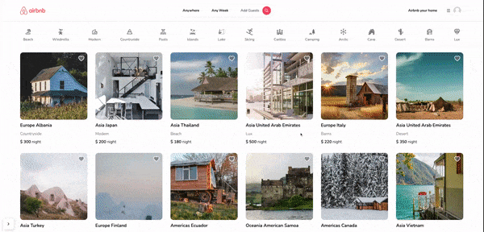

# nextjs-airbnb-clone

nextjs-airbnb-clone is a project that aims to replicate the core functionality and design of the popular Airbnb website. It provides users with a platform to search and book accommodations in various countries. This project is built with Next.js, NextAuth, Prisma, Zustand, Tailwind and MongoDB.

## Features

- Full responsiveness
- Credential authentication
- Google authentication
- Github authentication
- Image upload using Cloudinary CDN
- Client form validation and handling using react-hook-form
- Server error handling using react-toast
- Calendars with react-date-range
- Page loading state
- Page empty state
- Booking / Reservation system
- Guest reservation cancellation
- Owner reservation cancellation
- Creation and deletion of properties
- Pricing calculation
- Advanced search algorithm by category, date range, map location, number of guests, rooms and bathrooms
  - For example we will filter out properties that have a reservation in your desired date range to travel
- Favorites system
- Shareable URL filters
  - Lets say you select a category, location and date range, you will be able to share URL with a logged out friend in another browser and they will see the same results

## Demo

For a live demo, you can visit [the project's website](https://nextjs-airbnb-clone-4o96-et6ge6rm1-haksoodev.vercel.app/).

## Installation

To run this project locally, follow these steps:

1. Clone the repository: `git clone https://github.com/HakSooDev/nextjs-airbnb-clone.git`
2. Navigate to the project directory: `cd nextjs-airbnb-clone`
3. Install the dependencies: `npm install`
4. Start the development server: `npm run dev`
5. Open your browser and visit: `http://localhost:3000`

## Usage

After installing and running the project locally, you can access the application in your browser. Use the provided search bar to enter your desired location, select the dates and number of guests/rooms/bathrooms, and click on the "Search" button. The application will display a list of available accommodations matching your search criteria. Click on any accommodation to view its details, including photo, description, and available dates. You can also create an account, log in(Oauth), and manage your bookings through the user dashboard.

## Contributing

Contributions are welcome! If you find any issues or have suggestions for improvements, please feel free to open an issue or submit a pull request. When contributing, make sure to follow the existing coding style and guidelines.

## Acknowledgments

- The project was inspired by the Airbnb website and aims to replicate its core functionality and design.
- Special thanks to [Next.js](https://nextjs.org/) and [Tailwind CSS](https://tailwindcss.com/) for their excellent frameworks.
- Thanks to [YouTube Tutorial](https://www.youtube.com/watch?v=c_-b_isI4vg) by [AntonioErdeljac](https://github.com/AntonioErdeljac) for providing guidance and instructions on building this project.

## Contact

If you have any questions, suggestions, or feedback, feel free to reach out to the project maintainer:

- HakSooDev
- Email: haksoo.j.kim@gmail.com
